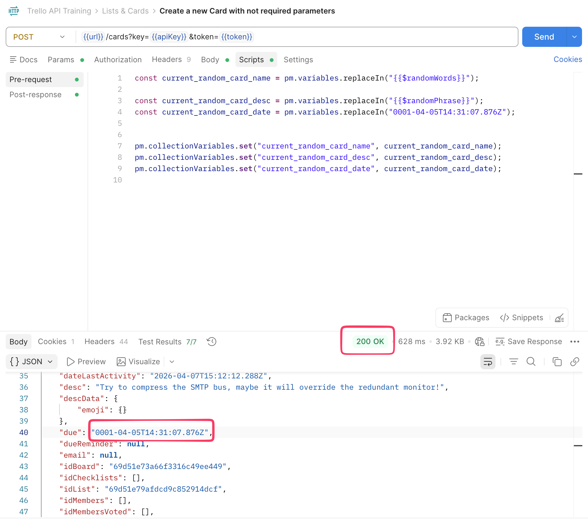

## BUG Report BR-01 

**ID:** BR-01 
**Summary:** Missing boundary value validation for 'due' field when creating a new card
**Status:** New 🟢  
**Author:** Sofiia Hnidan  
**Type:** Logical  
**Severity:** Minor  
**Priority:** Low

### 🌐 Environment
* **Browsers:** 
  * Safari Version 17.6 (19618.3.11.11.5)
  * Chrome Version 145.0.7632.160 (Official Build, arm64)
  * Firefox 148.0 (aarch64)
    

### Preconditions
1. Download Trello Api Training collectin from : ../trello-api-tests/Trello API Training.postman_collection.json
2. Import collection to Postman
3. Set variables: url - https://api.trello.com/1/, apiKey - your apiKey, token - your token
4. Send "Auth with valid keys" (GET) request to verify successful authorization.

### 👣 Steps to Reproduce
1. Send "Create new board" (POST) request to create a new board
2. Verify that the board was created (Server responded with status "200 OK")
3. Send "Create a new list on a board by Id" (POST) request to create a new list
4. Verify that the list was created (Server responded with status "200 OK").
5. Open the (POST) request: "Create a new Card with not required parameters"
6. Click on the "Scripts" tab in the request builder
7. Select the "Pre-request" sub-tab
8. Locate the variable: current_random_card_date
9. Copy its value and paste it somewhere safe; it is needed for the postconditions
10. Modify it's value to: 0001-04-05T14:31:07.876Z
11. Click the "Send" button to create a new card
12. Examine the JSON response and find "due" field
13. Compare the "due" value with the one provided in Step 9

### ❌ Actual Result
* Card was successfully created
* The "due" value is set to "0001-04-05T14:31:07.876Z", which is unrealistic date

### ✅ Expected Result
* The card should not be created
* An error message should appear regarding an invalid date range for the "due" field
* The server should respond with status "400 Bad Request"
  

### Postconditions
1. Navigate back to the "Pre-request" sub-tab of the "Create a new Card with not required parameters" (POST) request.
2. Locate the "current_random_card_date" variable.
3. Revert its value to the original date copied in Step 9 of the Steps to Reproduce.

---

### 🖼️ Attachment
