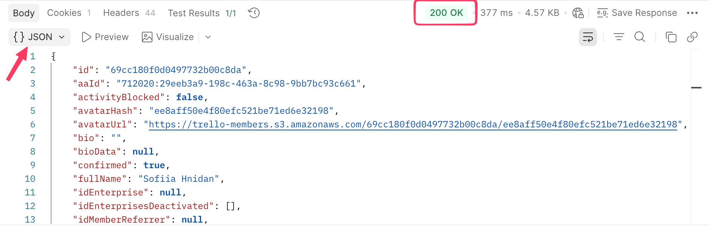
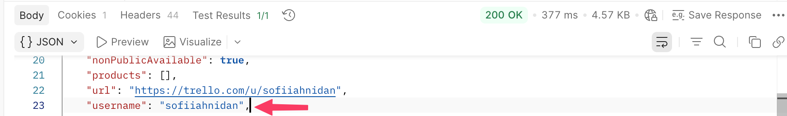
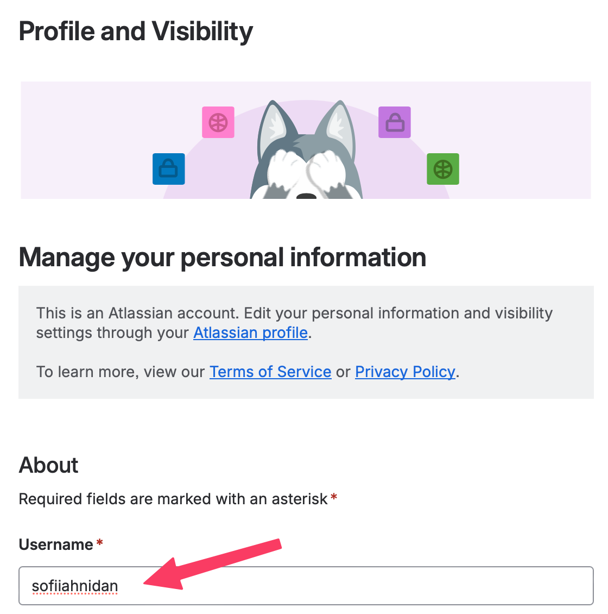
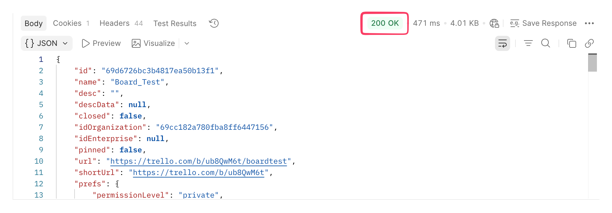
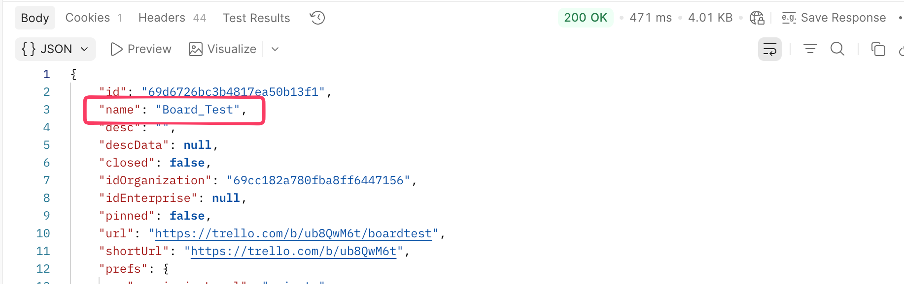
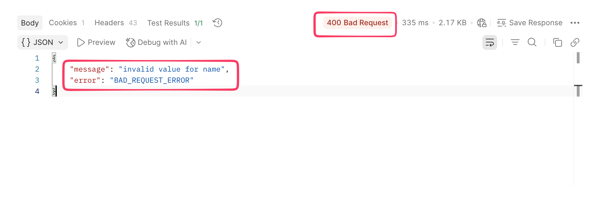
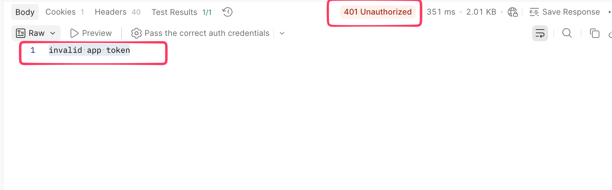

# Test Cases
---
# Test Case TC-01

**id:** TC-01
**Title:** Authentication (valid) & Data Consistency (API to UI)
**Priority:** `High`  
**Test Data:** 
* `apiKey`: [Your Valid Key]
* `token`: [Your Valid Token]
* `username`: `sofiiahnidan`

### Preconditions
1. **User Status:** User is logged into Trello in a web browser.
2. **Configuration:** Ensure your the API Key and Token are valid

### Steps:
Step| Action | Expected result |
| :--- | :--- | :--- |
| 1. | Prepare (GET) request to: "/members/me" | The endpoint is correctly set |
| 2. | Send the request using valid key and token as query parameters | Status code is "200 OK"; Response body contains a JSON object   |
| 3. | Browse response body, locate username key and note its value | Username value is identified (e.g., sofiiahnidan)    |
| 4. | Open Trello in a web browser | The Trello web app is opened |
| 5. | Click on your user profile icon in the top right corner| Account menu is opened |
| 6. | Click on the "Profile and Visibility" menu section | Profile and Visibility page is opened |
| 7. | Locate the Username field | username field is visible    |
| 8. | Compare Username field value with the data obtained from API in step 2 | The username value from the UI matches the value retrieved from the API response |

### 📌 Summary & Notes
* **Pass/Fail Criteria:** The test is considered **PASSED** only if the status code is 200 and the usernames in both API and UI are identical.

-------------------------
# Test Case TC-02

**id:** TC-02
**Title:** Create Board via API with required parameter (valid) and verify in the Web UI
**Priority:** `High`  
**Test Data:** 
* `name`: `Board_Test`

### Preconditions
1. Completed TC-01
2. Prepared JSON schema for board object

### Steps:
Step| Action | Expected result |
| :--- | :--- | :--- |
| 1. | Prepare (POST) request to: "/boards/" | The endpoint is correctly set|
| 2. | Prepare (POST) request body with JSON including "name" parameter:  (e.g., { "name": "Board_Test" } ) | Request body is correctly formated and name parameter contains a  string type value |
| 3. | Send the request using valid key and token as query parameters | Status code is "200 OK"; Response body caontains JSON object   |
| 4. | Compare board JSON schema with JSON obtained from the response body | JSON response matches JSON Schema |
| 5. | Locate "name" key in response object | "name" key is located    |
| 6. | Compare "name" key value with the name provided in request body | The name from request body matches the name value retrieved from request response |
| 7. | Open Trello in web browser | Trello web aplication is opened |
| 8. | Ensure you can see all workspace boards  | All workspace boards are visible |
| 9. | Verify that created board in step 3 is present on the list of boards | Board is present; Board Name matches the name provided in the request body   |

### 📌 Summary & Notes
* **Pass/Fail Criteria:** The test is considered **PASSED** only if the status code is 200 and the board "name" in both API and UI are identical.

-------------------------

# Test Case TC-03

**id:** TC-03
**Title:** Create card with illogical "due" date (Past date)
**Priority:**
**Test data:**
* `listId`: `69d6794b76d732122241fd42`
* `due`: `0001-04-05T14:31:07.876Z`

### Preconditions:
1. Ensure your API Key and Token are valid
2. Board and list on that board are created

### Steps:
Step| Action | Expected result |
| :--- | :--- | :--- |
| 1. | Prepare (POST) request to "/cards" | The endpoint is correctly set |
| 2. | Prepare request body with JSON including idList, due parameters (e.g., { "idList": "69d6794b76d732122241fd42", "due": "0001-04-05T14:31:07.876Z"})| Request body is correctly formatted; idList contains a string value; due contains a date value in ISO 8601 format |
| 3. | Send the request using valid key and token as query parameters | Status code is "400 Bad Request"; Server response contains message regarding invalid date range |

### 📌 Summary & Notes
* **Pass/Fail Criteria:** The test is considered **PASSED** only if the status code is 400 and error message regarding invalid date range is present

-------------------------
# Test Case TC-04

**id:** TC-04
**Title:** Create a list on the board with name parameter invalid value type
**Priority:**
**Test data:**
* `name`: true
* `boardId` : `69d6726bc3b4817ea50b13f1`

### Preconditions:
1. Ensure your API Key and Token are valid
2. Board is created

### Steps:
Step| Action | Expected result |
| :--- | :--- | :--- |
| 1. | Prepare (POST) request to "boards/{{boardId}}/lists" | The endpoint is correctly set |
| 2. | Prepare request body with JSON including name parameter (e.g., { "name": true})| Request body is correctly formatted; name contains a Boolean value  |
| 3. | Send the request using valid key and token as query parameters | Status code is "400 Bad Request"; Server response contains message regarding invalid value for name   |

### 📌 Summary & Notes
* **Pass/Fail Criteria:** The test is considered **PASSED** only if the status code is 400 and error message regarding invalid value for name is present

-------------------------

# Test Case TC-05

**id:** TC-05
**Title:** Authentication (invalid token) 
**Priority:** `High`  
**Test Data:** 
* `apiKey`: [Your Valid Key]
* `token`: `879272nnnz829`

### Preconditions
1. **Configuration:** Ensure your the API Key is valid

### Steps:
Step| Action | Expected result |
| :--- | :--- | :--- |
| 1. | Prepare (GET) request to: "/members/me" | The endpoint is correctly set |
| 2. | Send the request using valid key and invalid token (e.g.,'879272nnnz829 ') as query parameters | Status code is "401 Bad Request"; Response body contains a message regarding invalid app token   |

### 📌 Summary & Notes
* **Pass/Fail Criteria:** The test is considered **PASSED** only if the status code is 401 and the message regarding invalid app token is present.

-------------------------