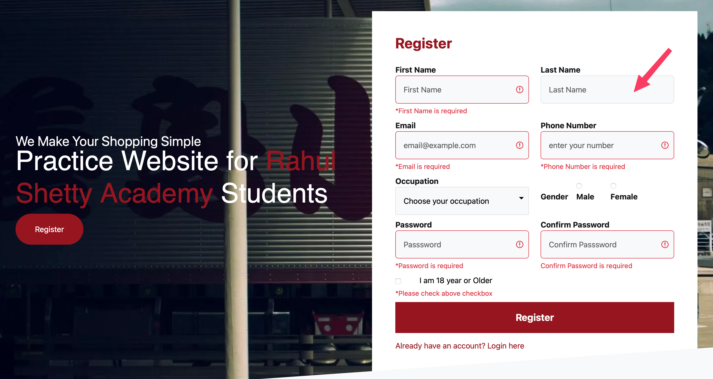

## BUG Report BR-01 

**ID:** BR-01 
**Summary:** The error message regarding required 'Last Name' field is missing
**Status:** New 🟢  
**Author:** Sofiia Hnidan  
**Type:** Functional
**Severity:**  Minor
**Priority:**  Low

### 🌐 Environment
* **Browsers:** 
  * Safari Version 17.6 (19618.3.11.11.5)
  * Chrome Version 145.0.7632.160 (Official Build, arm64)
  * Firefox 148.0 (aarch64)
    

### Preconditions
1. Open: https://rahulshettyacademy.com/client/#/auth/register

### 👣 Steps to Reproduce
1. Ensure you can see the registration form
2. Click on the register button
3. Browse fields where appeared message regarding missing value. Required field 'Last name' doesn't have this message
4. Fill in the form with values: First Name: Mike, Email: mike543@gmail.com, Phone Number: 8972570152, Password: mike87@Ghy, Confirm Password: mike87@Ghy
5. Select 'I am 18 year or Older' checkbox
6. Click on the 'Register' button

### ❌ Actual Result
* Form is not accepre

### ✅ Expected Result
* 

### Postconditions
1. 

---

### 🖼️ Attachment

png)